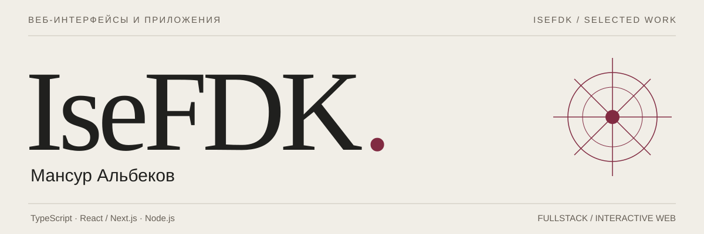
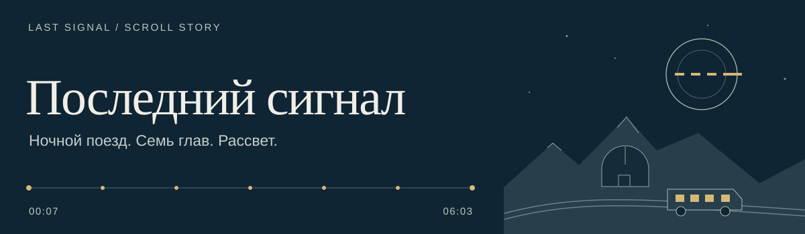
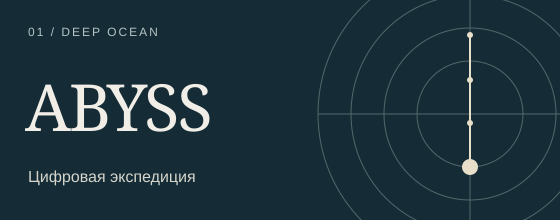
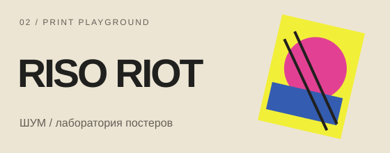
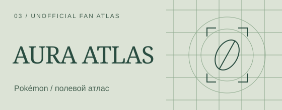
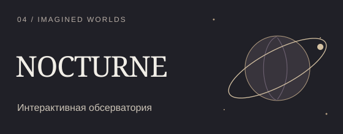

Создаю веб-интерфейсы и приложения на **TypeScript, React / Next.js и Node.js**. Здесь — fullstack-проекты, интерактивные инструменты, иллюстрированные истории и веб-эксперименты с 3D.

**[Открыть портфолио ↗](https://isefdk.github.io/)** · [Исходники портфолио](https://github.com/IseFDK/isefdk.github.io)

Шесть подробных кейсов: идея, взаимодействие, технические решения и границы каждого проекта.

## Последний сигнал / новая работа

Иллюстрированный рассказ в семи главах: ночной поезд, закрытая горная обсерватория и знакомый сигнал. Нативный скролл управляет многослойными сценами от полуночи до рассвета.

Отдельная версия для чтения, режим без движения, навигация по главам и повтор путешествия. Собственный текст, SVG-сцены и иллюстрации, созданные специально для проекта с AI-помощью.

**Стек:** JavaScript · CSS · SVG · WebP · без runtime-библиотек

**[Открыть рассказ ↗](https://isefdk.github.io/last-signal/)** · [Версия для чтения](https://isefdk.github.io/last-signal/read.html) · [Кейс в портфолио](https://isefdk.github.io/work/last-signal/) · [Код и устройство проекта](https://github.com/IseFDK/last-signal)

## Избранные проекты

<table>
  <tr>
    <td width="50%" valign="top">
      
      
Вымышленная глубоководная экспедиция: scroll-driven 3D, научный атлас и разбор концептуального аппарата.

      
JavaScript · Three.js · Vite

      
<a href="https://isefdk.github.io/abyss-expedition/">Сайт ↗</a> · <a href="https://github.com/IseFDK/abyss-expedition">Код</a>

    </td>
    <td width="50%" valign="top">
      
      
Концепт печатного клуба: выставка авторских постеров и редактор с палитрами, слоями и экспортом SVG / PNG.

      
JavaScript · SVG · Canvas

      
<a href="https://isefdk.github.io/riso-riot/">Сайт ↗</a> · <a href="https://github.com/IseFDK/riso-riot">Код</a>

    </td>
  </tr>
  <tr>
    <td width="50%" valign="top">
      
      
Некоммерческий неофициальный Pokémon фан-проект: покедекс, конструктор команды, анализ защиты и полевой блокнот.

      
JavaScript · WebGL · Локальные данные PokeAPI

      
<a href="https://isefdk.github.io/aura-atlas/">Сайт ↗</a> · <a href="https://github.com/IseFDK/aura-atlas">Код</a>

    </td>
    <td width="50%" valign="top">
      
      
Три вымышленных процедурных мира: управляемая камера, свет, тихий режим и последовательный маршрут наблюдения.

      
JavaScript · Three.js · GLSL

      
<a href="https://isefdk.github.io/nocturne-observatory/">Сайт ↗</a> · <a href="https://github.com/IseFDK/nocturne-observatory">Код</a>

    </td>
  </tr>
</table>

### [LEDGER](https://github.com/IseFDK/ledger-diploma) / fullstack

Дипломная система финансового учёта и аналитики малого бизнеса: роли, журнал операций, бюджеты, отчёты, AI-анализ, аудит и мониторинг.

**Стек:** TypeScript · Next.js · React · Node.js / Express · PostgreSQL · Prisma · Docker

[Исходный код и локальный запуск ↗](https://github.com/IseFDK/ledger-diploma) · публичной работающей демоверсии нет

---

ABYSS, RISO RIOT, AURA ATLAS и NOCTURNE — самостоятельные концептуальные проекты, созданные с AI-помощью. Pokémon и персонажи принадлежат соответствующим правообладателям; AURA ATLAS не связан с ними и не одобрен ими. Источники, происхождение ассетов и ограничения описаны в README проектов.
